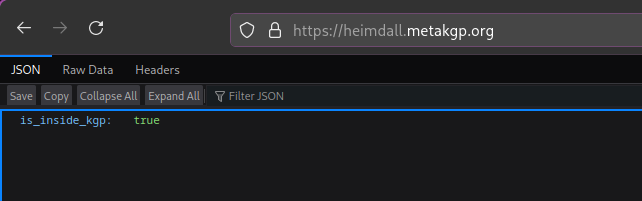
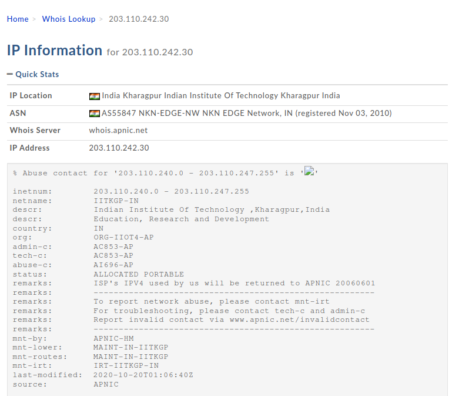

<div id="top"></div>

<!-- PROJECT SHIELDS -->
<!-- https://www.markdownguide.org/basic-syntax/#reference-style-links-->
<div align="center">

[![Contributors][contributors-shield]][contributors-url]
[![Forks][forks-shield]][forks-url]
[![Stargazers][stars-shield]][stars-url]
[![Issues][issues-shield]][issues-url]
[![MIT License][license-shield]][license-url]
[![Wiki][wiki-shield]][wiki-url]

</div>

<!-- PROJECT LOGO -->
<br />
<!-- UPDATE -->
<div align="center">
  <a href="https://github.com/metakgp/heimdall">
    
  </a>

  <h3 align="center">Heimdall</h3>

  <p align="center">
  <!-- UPDATE -->
    <i>The network checker and Institute Email verification for IIT KGP</i>
    <br />
    <a href="https://github.com/metakgp/heimdall/issues">Report Bug</a>
    ·
    <a href="https://github.com/metakgp/heimdall/issues">Request Feature</a>
  </p>
</div>

<!-- TABLE OF CONTENTS -->
<details>
<summary>Table of Contents</summary>

- [About The Project](#about-the-project)
- [Getting Started](#getting-started)
    - [Prerequisites](#prerequisites)
    - [Installation](#installation)
    - [Google configuration](#google-configuration)
    - [How to use](#how-to-use)
- [How does this work?](#how-does-this-work)
    - [Campus network check](#campus-network-check)
    - [Institute email verification and session management](#institute-email-verification-and-session-management)
- [Why heimdall as a service?](#why-heimdall-as-a-service)
- [Maintainer(s)](#maintainers)
    - [Past Maintainer(s)](#past-maintainers)
- [Contact](#contact)
- [Additional documentation](#additional-documentation)

</details>

<!-- ABOUT THE PROJECT -->

## About The Project

<!-- UPDATE -->

_Heimdall checks the client's IP to know whether the request has originated from inside the IIT Kharagpur network can also verify their institute email ID. This helps to ascertain if the client is a current member of the institute and should have access to the information provided by metaKGP services protected by Heimdall._

<p align="right">(<a href="#top">back to top</a>)</p>

## Getting Started

This repository contains:

- A Go backend (API) that does campus-network checks, OTP verification, and Google Sign-In, and issues a session cookie for `*.metakgp.org`.
- A React + Vite frontend used as the login portal.

Local development is easiest when you run both:

- Backend: `http://localhost:3333`
- Frontend: `http://localhost:5173`

### Prerequisites

The following dependencies are required to be installed for the project to function properly:

- [go](https://go.dev/)
- [nodejs](https://nodejs.org/en/download/package-manager)
- [pnpm](https://pnpm.io/) (or install via `npm install -g pnpm`)

> Note: Heimdall uses **two different Google configurations**:
>
> 1. **Gmail API OAuth** for sending OTP emails (server-side; uses `credentials.json` + `token.json`).
> 2. **Google Sign-In (GIS)** for logging in with institute Google Workspace email (client-side button + server-side ID token verification).

- [OAuth consent screen](https://developers.google.com/workspace/guides/configure-oauth-consent#configure_oauth_consent).
- [OAuth client ID credentials](https://developers.google.com/workspace/guides/create-credentials#oauth-client-id).
- While creating OAuth client ID credentials, set the redirect URL to any port of localhost.
- Save the downloaded JSON file as `credentials.json` in the project's root directory.
- Then enable [Gmail API](https://console.cloud.google.com/apis/library/gmail.googleapis.com) to enable receiving OTP.

<p align="right">(<a href="#top">back to top</a>)</p>

### Installation

_Now that the environment has been set up and configured to properly compile and run the project, the next step is to install and configure the project locally on your system._

<!-- UPDATE -->

1. Clone the repository
    ```sh
    git clone https://github.com/metakgp/heimdall.git
    ```
2. Backend setup (Go)

3. Create backend env file

    ```sh
    cd ./heimdall
    cp .env.template .env
    ```

    Required:
    - `JWT_SECRET_KEY` (choose a strong value)

    Recommended for local dev:
    - `DEVELOPMENT_MODE=true` (already true in the template; enables localhost cookie + dev CORS)

    Optional:
    - `GOOGLE_OAUTH_CLIENT_ID` (needed only if you want Google Sign-In)

4. Install Go deps

    ```sh
    go mod download
    ```

5. Configure Gmail API OAuth for OTP sending

    OTP emailing requires a **separate** Google OAuth setup (not the Google Sign-In client ID).
    - Create a Google Cloud project (or use an existing one)
    - Configure OAuth consent screen
    - Enable **Gmail API**
    - Create OAuth client credentials and download the JSON
    - Save it as `credentials.json` in the repo root

    First run will prompt you to authorize and will generate `token.json`:
    - Start the backend (next step)
    - Open the printed URL
    - After it redirects to `localhost`, copy the `code=...` from the URL and paste it into the terminal

6. Run the backend

    ```sh
    go run .
    ```

    Backend listens on `:3333`.

7. Frontend setup (React + Vite)

```sh
cd ./frontend
pnpm install
```

(Optional) enable Google Sign-In button in local dev:

```sh
cp .env.template .env
```

Set:

- `VITE_GOOGLE_CLIENT_ID` (same value as backend `GOOGLE_OAUTH_CLIENT_ID`)

Run the frontend:

```sh
pnpm dev
```

### Google configuration

#### A) Gmail API OAuth (OTP email sending)

This is used only to send OTP emails from the backend.

Setup summary:

- Create OAuth consent screen
- Enable **Gmail API**
- Create an OAuth client (Desktop App) and download the credentials JSON
- Save it as `credentials.json` in the repo root

On first backend run, Heimdall will print an authorization URL; after granting access, Google redirects to localhost. Copy the `code=...` query param (and before &scope=) from that redirected URL and paste it into the backend terminal to generate `token.json`.

- Output files:
    - `credentials.json` (downloaded from Google Cloud Console)
    - `token.json` (generated locally on first run)
- API used: Gmail API (`gmail.send` scope)

#### B) Google Sign-In (GIS) (login without OTP)

This is used to let users sign in with their institute Google Workspace account and skip OTP.

1. Create an OAuth 2.0 **Client ID** (Web application).
2. Configure **Authorized JavaScript origins**:
    - `https://heimdall.metakgp.org`
    - (dev) `http://localhost:5173`
3. Set both env vars to the same Client ID:
    - Backend: `GOOGLE_OAUTH_CLIENT_ID`
    - Frontend: `VITE_GOOGLE_CLIENT_ID`

Security model (important): the frontend only receives a Google ID token; the backend validates it (audience/issuer/expiry/signature), enforces institute domains (`@iitkgp.ac.in` and `@kgpian.iitkgp.ac.in`), then issues the `heimdall` HttpOnly cookie.

<p align="right">(<a href="#top">back to top</a>)</p>

### How to use?

You can authenticate in either way:

- OTP: enter institute email, request OTP, and verify the OTP received.
- Google Sign-In: click the Google button and sign in with institute Google account (skips OTP).

Next, you will have access to services like [Naarad](https://github.com/metakgp/naarad), [Chillzone](https://github.com/metakgp/chillzone) and [Travel Buddy](https://github.com/metakgp/travel-buddy), which are available only for KGPians. These can be accessed via the campus network.

<p align="right">(<a href="#top">back to top</a>)</p>

<!-- BACKGROUND INFORMATION -->

## How does this work?

### Campus network check

<div align="center">
  <a href="https://github.com/metakgp/heimdall">
    
  </a>
</div>

IIT Kharagpur has its internal campus network, which is the primary source of Internet for its students, staff, and faculty.

For connection to the outside network (normal internet services), it uses a [NAT Gateway](https://docs.aws.amazon.com/vpc/latest/userguide/vpc-nat-gateway.html), which handles all requests going outside. While doing so, the client IP address in those requests is changed from the internal IP to one of the pool of public IP addresses assigned to IIT Kharagpur.

So, to check whether a request has originated from inside the IIT Kharagpur network, we just check whether the client's IP address belongs to one of those public IPs.

While just doing this would have sufficed, we do not know whether these Public IPs are permanent or are subject to change over time. We therefore do a Whois lookup of the IP address and check its response to decide whether this IP address belongs to IIT Kharagpur. A screenshot of such a Whois lookup is shown below.

<div align="center">
  <a href="https://github.com/metakgp/heimdall">
    
  </a>

_For complete Whois information, check [here](https://whois.domaintools.com/203.110.242.30)._

</div>

> Note: The above functionality is implemented in the main (`/`) route

### Institute email verification and session management

When the user verifies via OTP (`/get-otp` + `/verify-otp`) or Google Sign-In (`/auth/google`), Heimdall issues a cookie valid for `*.metakgp.org` (including subdomains like `naarad.metakgp.org`, etc.). This cookie contains a signed JWT with the user's institute email.

The endpoint `/validate-jwt` validates the cookie that is sent along with the request to access internal services like Naarad and Gyft. Once the user's mail ID is verified, they can access the above services, making sure that they are accessible only to institute students.

<p align="right">(<a href="#top">back to top</a>)</p>

## Why heimdall as a service?

All this time, you might be wondering why you need a different server to just check this. Can't we do this in any project where such a feature is required?

Well yes. Provided it has a backend server. This cannot be done in the front-end because the Web Browser does not provide the IP information to the JavaScript engine. So, for projects that do not need a backend, like [Chillzone](https://github.com/metakgp/chillzone) or [ERP Auto Login](https://github.com/metakgp/iitkgp-erp-auto-login), this simple API call can do the required work.

Also, one service - to protect all of our services. Reducing code repetition and easy integration.

<p align="right">(<a href="#top">back to top</a>)</p>

## Maintainer(s)

- [Saharsh Agrawal](https://github.com/saharsh-agrawal)

### Past Maintainer(s)

- [Arpit Bhardwaj](https://github.com/proffapt)
- [Chirag Ghosh](https://github.com/chirag-ghosh)

<p align="right">(<a href="#top">back to top</a>)</p>

## Contact

<p>
📫 Metakgp -
<a href="https://bit.ly/metakgp-slack">
  
</a>
<a href="mailto:metakgp@gmail.com">
  
</a>
<a href="https://www.facebook.com/metakgp">
  
</a>
<a href="https://www.linkedin.com/company/metakgp-org/">
  
</a>
<a href="https://twitter.com/metakgp">
  
</a>
<a href="https://www.instagram.com/metakgp_/">
  
</a>
</p>

<p align="right">(<a href="#top">back to top</a>)</p>

## Additional documentation

- [License](/LICENSE)
- [Code of Conduct](/.github/CODE_OF_CONDUCT.md)
- [Security Policy](/.github/SECURITY.md)
- [Contribution Guidelines](/.github/CONTRIBUTING.md)

<p align="right">(<a href="#top">back to top</a>)</p>

<!-- MARKDOWN LINKS & IMAGES -->

[contributors-shield]: https://img.shields.io/github/contributors/metakgp/heimdall.svg?style=for-the-badge
[contributors-url]: https://github.com/metakgp/heimdall/graphs/contributors
[forks-shield]: https://img.shields.io/github/forks/metakgp/heimdall.svg?style=for-the-badge
[forks-url]: https://github.com/metakgp/heimdall/network/members
[stars-shield]: https://img.shields.io/github/stars/metakgp/heimdall.svg?style=for-the-badge
[stars-url]: https://github.com/metakgp/heimdall/stargazers
[issues-shield]: https://img.shields.io/github/issues/metakgp/heimdall.svg?style=for-the-badge
[issues-url]: https://github.com/metakgp/heimdall/issues
[license-shield]: https://img.shields.io/github/license/metakgp/heimdall.svg?style=for-the-badge
[license-url]: https://github.com/metakgp/heimdall/blob/master/LICENSE
[wiki-shield]: https://custom-icon-badges.demolab.com/badge/metakgp_wiki-grey?logo=metakgp_logo&style=for-the-badge
[wiki-url]: https://wiki.metakgp.org
